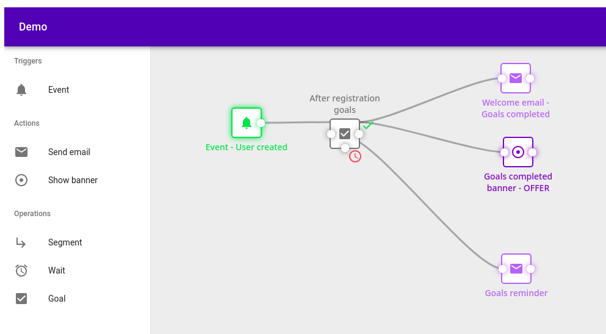
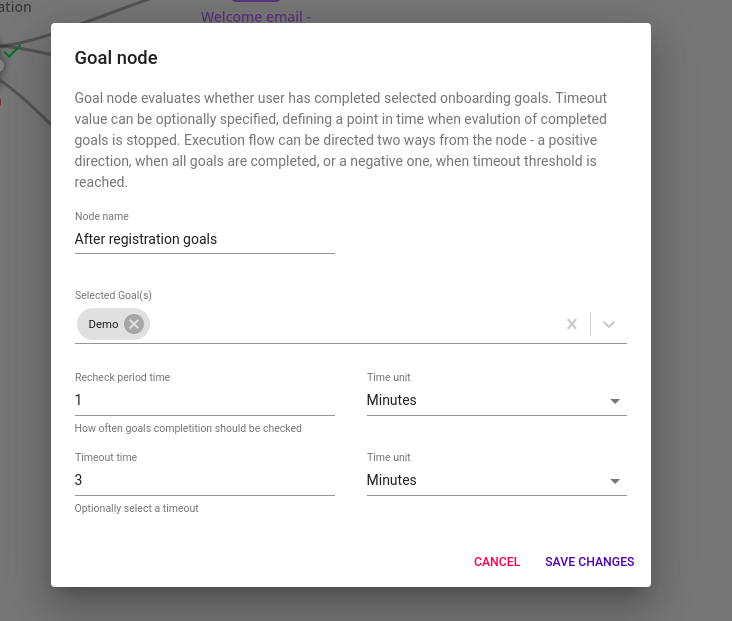

# CRM Onboarding Module

## Installing module

We recommend using Composer for installation and update management.

```shell
composer require remp/crm-onboarding-module
```

### Enabling module

Add installed extension to your `app/config/config.neon` file.

```neon
extensions:
	- Crm\OnboardingModule\DI\OnboardingModuleExtension
```

When it's added, generate ACL for newly created module.

```bash
php bin/command.php user:generate_access
php bin/command.php api:generate_access
php bin/command.php application:seed
```

At this point you (superadmin) should be able to define new goals via People - Onboarding goals admin menu (`/onboarding/onboarding-goals-admin/`) and internal API token should have access to the exposed API endpoints.

If you need other roles to access goal definition, you can assign access to roles at People - Admin rights page (`/users/admin-group-admin/`).

## Using onboarding

Onboarding module lets you define goals that your users should achieve. The goal is merely a label with flag describing whether it was finished by a user or not.

Once the goal is defined, head to the Scenario builder and create a scenario including "Goal" element. The element can be configured with following properties:

- Which goals need to be completed for element to trigger "success" branch.
- How often CRM should check whether goals are completed.
- How long CRM should wait (timeout) before giving up on goal and triggering "fail" branch.

<details>
<summary>Preview</summary>





</details>

### Completing goals

The completion of the goal can differ based on the type of goal. Currently we plan to support two types of goals:

- *Simple*. These type of goals have to be completed explicitly for each user by calling [onboarding-goals/complete]() API endpoint.
- *Beam* (not available yet). These type of goals have Beam event defined as a trigger. Once the event is submitted to Beam, goal will be automatically completed for given user in CRM.

## API documentation

All examples use `http://crm.press` as a base domain. Please change the host to the one you use
before executing the examples.

All examples use `XXX` as a default value for authorization token, please replace it with the
real tokens:

* *API tokens.* Standard API keys for server-server communication. It identifies the calling application as a whole.
They can be generated in CRM Admin (`/api/api-tokens-admin/`) and each API key has to be whitelisted to access
specific API endpoints. By default the API key has access to no endpoint. 
* *User tokens.* Generated for each user during the login process, token identify single user when communicating between
different parts of the system. The token can be read:
    * From `n_token` cookie if the user was logged in via CRM.
    * From the response of [`/api/v1/users/login` endpoint](https://github.com/remp2020/crm-users-module#post-apiv1userslogin) -
    you're free to store the response into your own cookie/local storage/session.

API responses can contain following HTTP codes:

| Value | Description |
| --- | --- |
| 200 OK | Successful response, default value | 
| 400 Bad Request | Invalid request (missing required parameters) | 
| 403 Forbidden | The authorization failed (provided token was not valid) | 
| 404 Not found | Referenced resource wasn't found | 

If possible, the response includes `application/json` encoded payload with message explaining
the error further.

---

#### POST `/onboarding-goals/complete`

API call completes *simple* goal for specific user.

##### *Headers:*

| Name | Value | Required | Description |
| --- |---| --- | --- |
| Authorization | Bearer *String* | yes | Bearer token. |

##### *Body:*

```json5
{
	"goal_code": "demo", // String; required; code of the simple goal
	"user_id": 301109 // Integer; required; ID of user completing the goal
}
```

##### *Examples:*

<details>
<summary>curl</summary>

```shell
curl -X POST \
  http://crm.press/api/v1/onboarding-goals/complete \
  -H 'Content-Type: application/javascript' \
  -H "Authorization: Bearer XXX" \
  -d '{
	"goal_code": "demo",
	"user_id": 301109
}'
```

</details>

<details>
<summary>raw PHP</summary>

```php
$payload = [
    "goal_code" => "demo",
    "user_id" => 301109,
];
$jsonPayload = json_encode($payload);
$context = stream_context_create([
        'http' => [
            'method' => 'POST',
            'header' => "Content-Type: type=application/json\r\n"
                . "Accept: application/json\r\n"
                . "Content-Length: " . strlen($jsonPayload) . "\r\n"
                . "Authorization: Bearer XXX",
            'content' => $jsonPayload,
        ]
    ]
);
$response = file_get_contents("http://crm.press/api/v1/onboarding-goals/complete", false, $context);
// process response (raw JSON string)
```

</details>

Response:

```json5
{
    "status": "ok"
}
```

---

#### GET `/onboarding-goals/list`

Endpoint to list available all goals.

##### *Headers:*

| Name | Value | Required | Description |
| --- |---| --- | --- |
| Authorization | Bearer *String* | yes | Bearer token. |

##### *Examples:*

<details>
<summary>curl</summary>

```shell
curl -X GET \
  http://crm.press/api/v1/onboarding-goals/list \
  -H 'Content-Type: application/javascript' \
  -H "Authorization: Bearer XXX"
```

</details>

<details>
<summary>raw PHP</summary>

```php
$context = stream_context_create([
        'http' => [
            'method' => 'GET',
            'header' => "Content-Type: type=application/json\r\n"
                . "Accept: application/json\r\n"
                . "Authorization: Bearer XXX",
        ]
    ]
);
$response = file_get_contents("http://crm.press/api/v1/onboarding-goals/list", false, $context);
// process response (raw JSON string)
```

</details>

Response:

```json5
{
    "status": "ok",
    "goals": [
        {
            "name": "Demo", // name of the goal (to display)
            "code": "demo", // code of the goal (for backend communication)
            "type": "simple" // type of goal
        },
        // ...
    ]
}
```